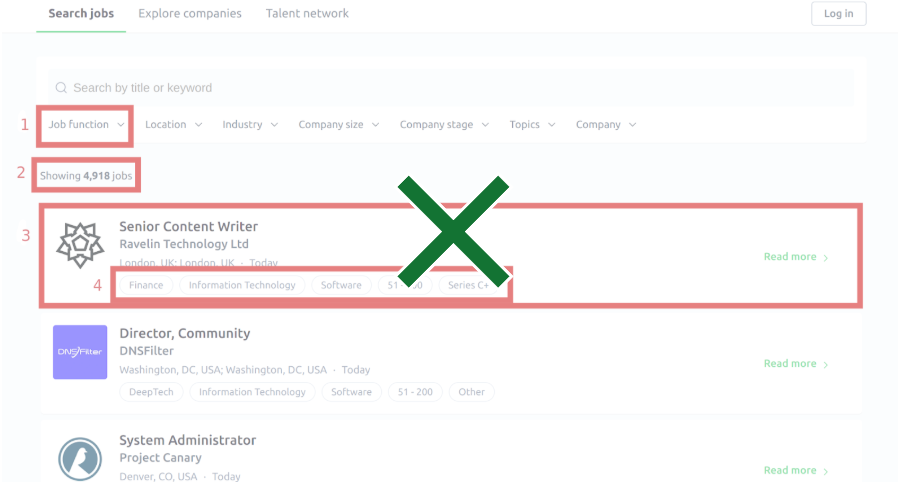
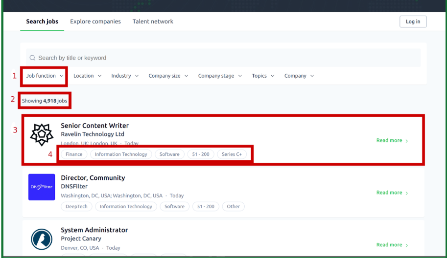

# Java Junior-level Technical Task

## 📋 Description
Application for scraping jobs from [jobs.techstars.com](https://jobs.techstars.com/jobs) by specific job function.

---

## 🧑‍💻 User Story
As a user, I want to have an application that can scrape job listings from [jobs.techstars.com](https://jobs.techstars.com/jobs) based on specific job functions.  
The application should allow me to:
- Input desired work functions or job categories.
- Automatically crawl the website and gather relevant job postings.
- Present the scraped data in a user-friendly format with key details.
- Filter or sort results by criteria such as **job location** or **posting date**.

This will simplify the job search process and improve my experience on the platform.

---

## 📄 List Page

**URL:** [https://jobs.techstars.com/jobs](https://jobs.techstars.com/jobs)

- Use the “Job function” dropdown menu to select a specific job function.
- Collect all jobs filtered by that specific function.

Elements to consider:
- Job function dropdown menu
- Number of filtered job results
- Job item
- Tags

---

## 📌 Job Item: Required Data Points

For **each job**, collect the following:

- Position name
- URL to organization
- Logo (link to image)
- Organization title
- Labor function
- Address (location)
- Posted date (save in Unix Timestamp)
- Description (HTML formatting)
- Tags (can be multiple)
  
---

## 📊 Data to Collect

| Field | Description |
|-------|-------------|
| `job page url` | URL to job detail page |
| `position name` | Name of the job position |
| `organization url` | URL to the hiring organization |
| `logo` | Link to organization's logo image |
| `organization title` | Name of the organization |
| `labor function` | Function/category of the job |
| `location` | Job location (split into parts if possible) |
| `posted date` | Convert to Unix timestamp |
| `description` | Job description with HTML formatting |
| `tags` | List of tags (if any) |

---

## ⚙ Technical Requirements

- **HTTP Request Libraries**: `okhttp`, `jsoup`
- **Framework**: `Spring Boot`
- **Page Rendering (if needed)**: `Selenium`, `Playwright`
- **Database**: Any SQL (e.g., PostgreSQL, MySQL)
- **ORM**: Use ORM for data persistence
- **Build Tool**: `Maven`

---

## ✅ Must Have

- Upload all source code to a **VCS** (GitHub, GitLab, Bitbucket)
- Use **Object-Oriented Programming (OOP)** principles
- Adhere to **clean code** practices
- Scraping results should be **dumped to SQL file**, including:
    - Job data
    - Database creation schema
- Provide:
    - `INSTALL.md` – setup and run instructions
    - `README.md` – short project description

---

## ✨ Bonus (Nice to Have)

- Use **Docker**
- Implement **Multithreading**
- Upload results to **Google Sheets** using **Google API**

---

## 📦 Result of Task

- Fully working code with additional files (`INSTALL.md`, `README.md`) uploaded to a public or private VCS
- SQL dump of **"Software Engineering" jobs**, including:
    - Database creation schema
    - Saved on Google Drive with access link
